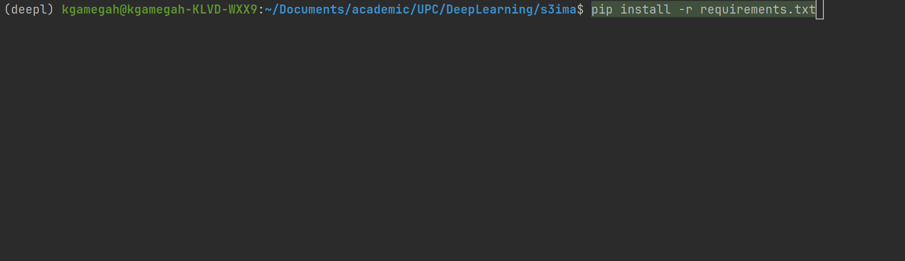
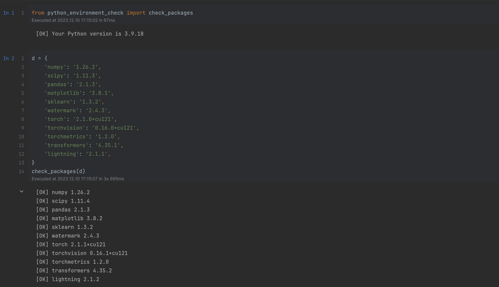

# Exploring Semi or Self Supervised learning methods for handling unlabeled data - S3Ima


## Constraints
We assume that we dispose of **100** samples **labeled data** for training deep learning 
architecture for image classification tasks. Our dataset is **MNIST** handwritten digit. 
Hence, we dispose of 100 $X$ and 100 $y$.

## Models Overview

### SimCLR 


<div align="center">
  
  <h6>credit: google SimCLR</h6>
</div>

<div align="center">
  An illustration of SimCLR (from <a href="https://github.com/google-research/simclr/blob/master/README.md">google-research SimCLR repository</a>).
</div>

### SGAN 


## Run Models
In order to run models, try the following commands according to specific model.

### LeNet5

Moving through LeNet5 folder and run ```run.py```

```shell
$ python run.py --mode train --epochs 100 
```

Let's breaking down available flags

- ```-m```, ```--mode```: which mode use during running model (```train``` or ```eval```)
- ```-data```: path to store or get dataset
- ```-dn```, ```--dataset-name```: which dataset use (default ```MNIST```)
- ```-a```, ```--arch```: architecture use as base line
- ```-b```, ```--batch-size```: train batch size
- ```-eval-batch-size```: eval batch size when **eval mode**
- ```--lr```, ```--learning-rate```: learning rate

### ResNet-18

Moving through ResNet-18 folder and run ```run.py```

```shell
$ python run.py --mode train --epochs 100 
```

Let's breaking down available flags

- ```-m```, ```--mode```: which mode use during running model (```train``` or ```eval```)
- ```-data```: path to store or get dataset
- ```-dn```, ```--dataset-name```: which dataset use (default ```MNIST```)
- ```-a```, ```--arch```: architecture use as base line
- ```-b```, ```--batch-size```: train batch size
- ```-eval-batch-size```: eval batch size when **eval mode**
- ```--lr```, ```--learning-rate```: learning rate

### SimCLR

Moving through SimCLR folder and run ```run.py```

```shell
$ python run.py --mode train --train-mode finetune --train-epochs 100
```

Let's breaking down available flags

- ```-m```, ```--mode```: which mode use during running model (```train``` or ```eval```)
- ```-tm```, ```--train-mode```:  type of training (```finetune``` or ```pretrain```)
  - **pretrain** for training contrastive layer
  - **finetune** for training classifier layer by freezing backbone(ResNet-18) pretrained layer.
-  ```-j```, ```--workers```: number of data loading workers
-  ```-te```, ```--train-epochs```: number of total epochs to run train'
-  ```-ee```, ```--eval-epochs```: number of total epochs to run test
-  ```-wd```, ```--weight-decay```: weight decay (default: 1e-4)
-  ```-s```, ```--seed```: seed
- ```--out-dim```: projection head out dimension
-  ```--temperature```: temperature
- ```--data```: path to store or get dataset
- ```-dn```, ```--dataset-name```: which dataset use (default ```MNIST```)
- ```-a```, ```--arch```: architecture use as base line
- ```-b```, ```--batch-size```: train batch size
- ```--eval-batch-size```: eval batch size when **eval mode**
- ```-lr```, ```--learning-rate```: learning rate

### SGAN
Due to experiment stage of SGAN, you can switch to  ```experiments/SGAN ``` folder and run python notebook
relate to it.

## Feature Evaluation

Feature evaluation is done using a linear model protocol.

First, we learned features using SimCLR on the ```MNIST unsupervised``` set. 
Then, we train a linear classifier on top of the frozen features from SimCLR. 
The linear model is trained on features extracted from the ```MNIST train``` 
set and evaluated on the ```MNIST test``` set.

Check the [](https://github.com/goamegah/s3ima/blob/master/s3ima/arch/SimCLR/prototype/eval.ipynb) notebook for reproducibility.

| Method                                | Architecture | Accuracy |
|---------------------------------------|--------------|----------|
| Supervised baseline                   | LeNet-5      | `73.73`  |
| Supervised baseline                   | ResNet-18    | `73.26`  |
| SimCLR                                | ResNet-18    | `93.84`  |
| SGAN                                  | ConvNet      | `94.65`  |

*Données entraînées sur* **100 epochs**.


## Libraries Used In This Project

We will be using the following libraries in this workshop, and I highly recommend 
installing them before attending the event:

- numpy >= 1.24.3 (The fundamental package for scientific computing with Python)
- scipy >= 1.10.1 (Additional functions for NumPy)
- pandas >= 2.0.2 (A data frame library)
- matplotlib >= 3.7.1 (A plotting library)
- jupyterlab >= 4.0 (An application for running Jupyter notebooks)
- ipywidgets >= 8.0.6 (Fixes progress bar issues in Jupyter Lab)
- scikit-learn >= 1.2.2 (A general machine learning library)
- watermark >= 2.4.2 (An IPython/Jupyter extension for printing package information)
- torch >= 2.0.1 (The PyTorch deep learning library)
- torchvision >= 0.15.2 (PyTorch utilities for computer vision)
- torchmetrics >= 0.11.4 (Metrics for PyTorch)

To install these requirements most conveniently, you can use the `requirements.txt` file:

```
pip install -r requirements.txt
```



Then, after completing the installation, please check if all the packages are installed and are up to date using

```
python python_environment_check.py
```


It's also recommended to check the versions in JupyterLab by running the `jupyter_environment_check.ipynb` in this 
directory. Ideally, it should look like as follows:




## More installation (Optional)
Fast data loading feedback on Tensorboard (Source: https://github.com/tensorflow/tensorboard/issues/4784)
```shell
$ pip uninstall -y tensorboard tb-nightly &&
$ pip install tb-nightly  # must have at least tb-nightly==2.5.0a20210316
```


